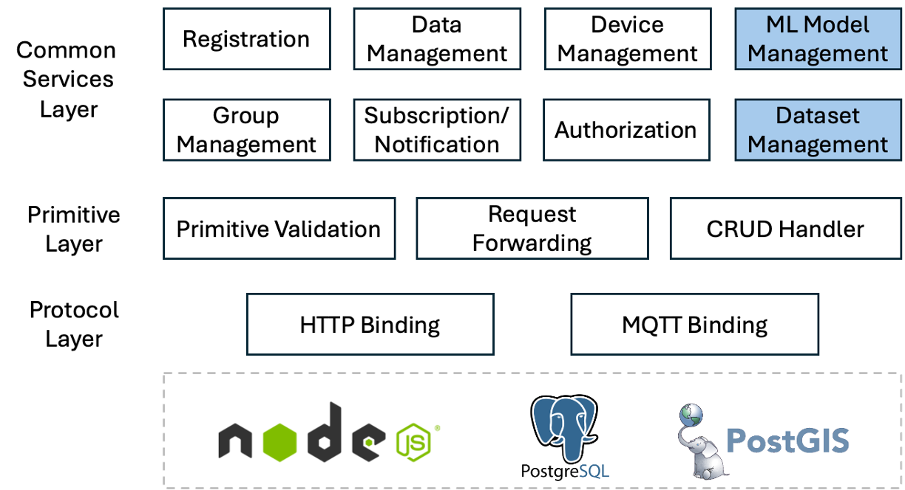

# About Mobius4

Mobius4 is the next version of [Mobius](https://github.com/iotketi/mobius) which basically implements the global IoT middleware standard, [oneM2M](https://www.oneM2M.org). This new version provides the new code base with modern Javascript async-await syntax for better readibility and maintenance. Also, the database has been changed from MySQL to PostgreSQL with PostGIS.

In oneM2M Release 5, [TR-0071](https://www.onem2m.org/technical/published-specifications/release-5) is defining candidate solutions for AIoT applications. Mobius4 implements those features in advance before the public release so developers can try them.



## oneM2M Certificate

Mobius4 is the first product to be certified as a oneM2M Release 2 compliant Common Services Entity (CSE, also known as an IoT platform). By the configuration, it runs as ASN/MN-CSE as well as IN-CSE.


## Supported oneM2M features

Mobius4 implements oneM2M Common Services Entity (CSE) which is the IoT middleware. By the configuration, it runs as ASN/MN-CSE as well as IN-CSE.

oneM2M protocol bindings:
- HTTP
- MQTT

oneM2M primitive serialization:
- JSON

oneM2M resource types (until Release 4):
- CSEBase, AE, remoteCSE
- accessControlPolicy
- container, contentInstance, latest, oldest
- subscription
- group, fanOutPoint

oneM2M resource types (oneM2M TR-0071, next release):
- modelRepo, mlModel, modelDeployList, modelDeployment 
- mlDatasetPolicy, dataset, datasetFragment 

Other features:
- discovery with _Filter Criteria_ parameter
- geo-query with _location_ common attribute (Rel-4 feature)
- children resources retrieval with _Result Content_ parameter

## Platform features

Beyond the oneM2M standard, Mobius4 includes the following operational capabilities for production deployments.

Observability:
- Structured JSON logging via [Pino](https://getpino.io) with daily log rotation (`logging.*`)
- Health check endpoint `GET /health` — for load balancers and container liveness probes
- Prometheus-compatible metrics endpoint `GET /metrics` (disabled by default; enable via `metrics.enabled`)

Security:
- HTTP security headers via [Helmet](https://helmetjs.github.io) (disabled by default; enable via `security.helmet.enabled`)
- Per-IP rate limiting (disabled by default; enable via `security.rateLimit.enabled`)

Resilience:
- Graceful shutdown on `SIGTERM`/`SIGINT` — ordered teardown of HTTP, MQTT, and database connections with a 30-second forced-exit fallback
- MQTT exponential backoff reconnection — configurable initial delay, multiplier, jitter, and max attempts (`mqtt.reconnect.*`)

Operations:
- Local configuration override via `config/local.json` (gitignored) — credentials and environment-specific settings never committed
- PM2 process management via `ecosystem.config.js` — auto-restart, environment profiles, graceful stop integration

## Postman scripts

Try oneM2M APIs over HTTP binding with Postman client. You can download [Postman script collection](./docs/Mobius4.postman_collection.json) and import it on your Postman. There are two variables set in the collection `mp_url` for Mobius4 platform URL and `cb` for CSEBase resource name, so please add in your Postman variable settings. 

## How-to documents

There are some modifications from the previous version so please check 
[Mobius4 how-to](docs/how-to.md) for the Mobius developers. If you're trying the new oneM2M features on AI, check [Rel-5 features how-to](docs/rel-5-how-to.md).


# Running Mobius4

## Prerequisites

Since Mobius4 is developed with Node.js and PostgreSQL, any operating system that supports them can run Mobius4.
- Node.js v22
- PostgreSQL v17
- PostGIS
- MQTT broker (e.g. Mosquitto)

For OS-specific installation instructions (Windows, macOS, Linux): [docs/installation.md](docs/installation.md)

## Installation

1. Create a database named `mobius4` on PostgreSQL

2. Get Mobius4 source codes from this git repository

```bash
    git clone https://github.com/iotketi/mobius4
```

3. Install node packages in the 'mobius4' folder
```bash
    cd mobius4
    npm install
```

4. Set Mobius4 configuration file

```bash
cp config/local.json.example config/local.json
# edit config/local.json with your DB credentials and local settings
```

5. Run Mobius4
```bash
    node mobius4.js
```

## Configurations

Full configuration reference: [docs/configuration.md](docs/configuration.md)

For deployment details (health check, metrics endpoint, PM2, resource browser): [docs/operations.md](docs/operations.md)


# Contact

iotketi@keti.re.kr

# Version history

## Mobius4 source code

| Version | Date | description |
| :---: | :---: | :--- |
| 4.0.0 | 2025-09-22 | Initial release of Mobius4 |
| 4.1.0 | 2026-03-13 | oneM2M Rel-2 certification |
| 4.2.0 | 2026-04-05 | logging module update |
