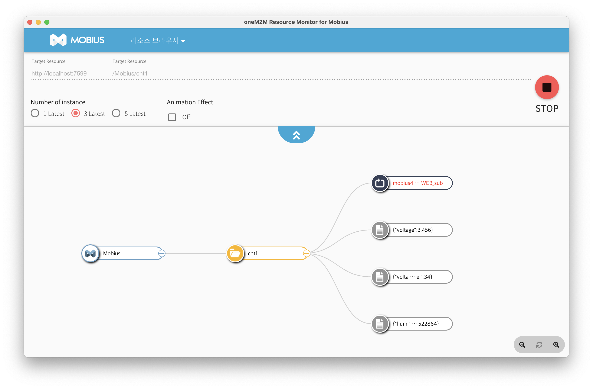

# Mobius4 Operations Guide

## PM2 Deployment

Install PM2 globally:
```bash
npm install -g pm2
```

Start / stop / restart:
```bash
pm2 start ecosystem.config.js --env production   # production start
pm2 stop mobius4
pm2 restart mobius4
pm2 delete mobius4
```

Check status and logs:
```bash
pm2 status
pm2 logs mobius4      # live stdout/stderr (Pino JSON)
```

> File logs are written by Pino to `logs/mobius4.log` when `logging.file.enabled: true`.

Enable auto-start on system boot:
```bash
pm2 startup           # run the printed command with sudo
pm2 save              # save current process list
```

---

## Health check endpoint

Mobius4 exposes a lightweight health check endpoint:

```
GET /health
```

Response:
```json
{ "status": "ok", "uptime": 123.45 }
```

This endpoint always returns HTTP 200 while the process is running. It is excluded from HTTP request logging to avoid noise. Use it for load balancer health checks, container liveness probes, or uptime monitors.

---

## Metrics endpoint

Mobius4 optionally exposes a Prometheus-compatible metrics endpoint:

```
GET /metrics
```

Disabled by default. Enable in `config/local.json`:
```json
{ "metrics": { "enabled": true } }
```

**When to enable:**
- Production deployments monitored by Prometheus/Grafana
- Capacity planning and trend analysis
- Debugging throughput or latency issues

**Keep disabled during:**
- Performance benchmarking and load testing — per-request counter increments add nanosecond-level overhead that skews baseline measurements

Excluded from HTTP access logging. Exposes default Node.js process metrics plus:

| Metric | Type | Description |
| :--- | :---: | :--- |
| `mobius4_http_requests_total{method, status_code}` | Counter | Total HTTP requests |
| `mobius4_http_request_duration_seconds{method}` | Histogram | HTTP response time |
| `mobius4_mqtt_messages_total` | Counter | MQTT messages received |
| `mobius4_resources_created_total{ty}` | Counter | oneM2M resources created by type |
| `mobius4_log_files_total` | Gauge | Current log file count |
| `mobius4_log_size_bytes` | Gauge | Total log file size in bytes |

> **Note:** Restrict `/metrics` to internal network or your Prometheus server only — it exposes operational details not intended for public access.

---

## Resource browser tool

Mobius provides a oneM2M resource browser tool for real-time monitoring of resource events in Mobius4. The Mobius4-compatible resource browser can be downloaded from the "Releases" menu on the GitHub repository.



When the popup requests an ACP Originator name, enter your Admin ID from the configuration (e.g. `SM`) to have full privileges to access all resources.
